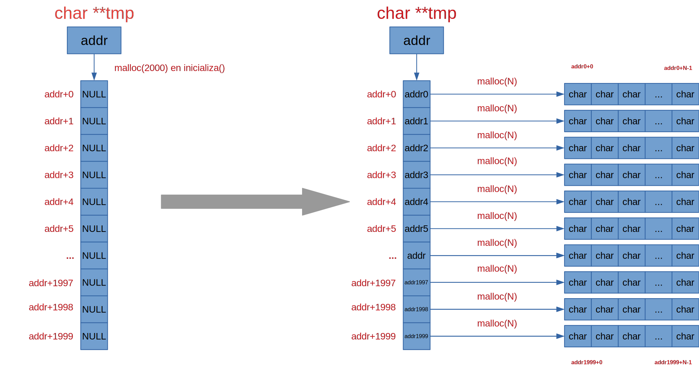
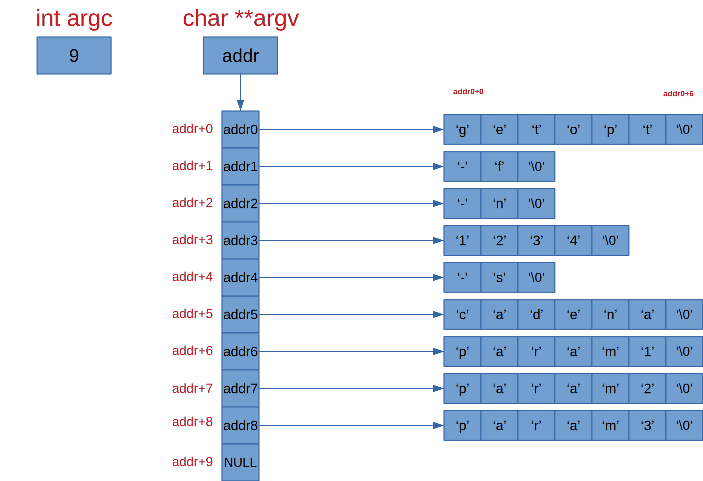
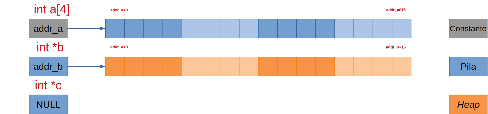

# Prácticas de Ampliación de Sistemas Operativos • Semana 1

- [Prácticas de Ampliación de Sistemas Operativos • Semana 1](#prácticas-de-ampliación-de-sistemas-operativos--semana-1)
  - [Instalación y configuración de Visual Studio Code](#instalación-y-configuración-de-visual-studio-code)
    - [Instalación](#instalación)
    - [Interfaz](#interfaz)
    - [Extensiones](#extensiones)
    - [Personalización](#personalización)
    - [Portabilidad](#portabilidad)
  - [Edición, compilación y ejecución de código C con Visual Studio Code](#edición-compilación-y-ejecución-de-código-c-con-visual-studio-code)
  - [Depuración de código C con Visual Studio Code](#depuración-de-código-c-con-visual-studio-code)
  - [Procesamiento de argumentos de línea de comandos en C](#procesamiento-de-argumentos-de-línea-de-comandos-en-c)
  - [Manejo de punteros en C](#manejo-de-punteros-en-c)
  - [Referencias](#referencias)
    - [C](#c)
    - [Llamadas al sistema y funciones de biblioteca](#llamadas-al-sistema-y-funciones-de-biblioteca)
    - [Visual Studio Code](#visual-studio-code)
    - [Markdown](#markdown)

___

## Instalación y configuración de Visual Studio Code

### Instalación

Visual Studio Code se puede descargar
[aquí](https://code.visualstudio.com/download). En Linux, se puede instalar de
varias formas diferentes:

<!-- markdownlint-disable MD013 -->
| Formato                                | Instrucciones                                                  |
| -------------------------------------- | -------------------------------------------------------------- |
| Paquete `.deb` (Ubuntu)                | `sudo apt install ./<VSCODEFILE>.deb`                          |
| Paquete `.rpm` (Fedora)                | `sudo yum install ./<VSCODEFILE>.rpm`                          |
| Contenedor `.tar.gz` (Ubuntu y Fedora) | `tar xzvf ./<VSCODEFILE>.tar.gz ; cd <VSCODEDIR>/bin ; ./code` |
| Paquete Snap                           | `sudo snap install --classic code`                             |
<!-- markdownlint-enable MD013 -->

:pushpin: También es posible instalar Visual Studio Code, tanto en Ubuntu como
en Fedora, utilizando el *repositorio* y *clave* correspondientes. Para más
detalles, véase [Using C++ on Linux in VS
Code](https://code.visualstudio.com/docs/cpp/config-linux).

### Interfaz

Configuración de Visual Studio Code para el idioma español:

<!-- markdownlint-disable MD013 -->
| Menú                                    | Acción                               |
| --------------------------------------- | ------------------------------------ |
| View : Command Palette (`Ctrl+Mayús+P`) | Configure Display Language (Español) |
<!-- markdownlint-enable MD013 -->

Principales componentes de la interfaz de usuario de Visual Studio Code:

- Barra de Actividades: Explorador, Búsqueda, Ejecución y Extensiones. Se puede
  ocultar/mostrar con `Ctrl+B`.
- Editor con soporte para pestañas y múltiples áreas de edición.
- Terminal. Se puede ocultar/mostrar con `Ctrl+J`.
- Barra de Estado: Información sobre errores y edición.

Cada acción en Visual Studio Code corresponde a un comando que se puede ejecutar
utilizando la Paleta de Comandos (Ver : Paleta de comandos o `Ctrl+Mayús+P`) o
directamente mediante un atajo de teclado.

<!-- markdownlint-disable MD013 -->
| Menú                               | Acción                                             | Atajo de teclado |
| ---------------------------------- | -------------------------------------------------- | ---------------- |
| Ayuda : Bienvenido                 | Ayuda : Bienvenido                                 |                  |
| Ayuda : Área de juegos interactiva | Ayuda: Área de juegos interactiva                  |                  |
| Ayuda : Documentación              | Ayuda: Documentación                               |                  |
| Ver   : Paleta de comandos         | Ayuda: Información general de la interfaz          |                  |
| Ver   : Paleta de comandos         | Preferencias : Abrir métodos abreviados de teclado | Ctrl+K Ctrl+S    |
| Ver   : Paleta de comandos         | Ayuda: Referencia de métodos abreviados de teclado | Ctrl+K Ctrl+R    |
| Ver   : Paleta de comandos         | Comando...                                         | ...              |
<!-- markdownlint-enable MD013 -->

### Extensiones

Configuración de Visual Studio Code para el lenguaje de programación C/C++:

| Extensión | Autor     |
| --------- | --------- |
| C/C++     | Microsoft |

Extensiones usadas para la preparación del material de estas prácticas:

| Extensión           | Autor        |
| ------------------- | ------------ |
| Markdown All in One | Yu Zhang     |
| Markdown Emoji      | Matt Bierner |
| markdownlint        | David Anson  |
| vscode-icons        | Microsoft    |

Otras extensiones populares:

| Extensión                          | Autor     |
| ---------------------------------- | --------- |
| Remote Development                 | Microsoft |
| Microsoft Visual Studio Live Share | Microsoft |

### Personalización

| Menú                   | Acción        |
| ---------------------- | ------------- |
| Archivo : Preferencias | Configuración |
| Archivo : Preferencias | Tema de color |
| Archivo : Preferencias | Tema de icono |

### Portabilidad

Visual Studio Code soporta un modo *portable* que permite crear y mantener su
configuración y extensiones en un directorio independiente. Este modo sólo está
soportado en la instalación mediante un archivo contenedor `.tar.gz`. Para
activar el modo *portable*, hay que crear un subdirectorio `data` dentro del
directorio de Visual Studio Code:

```none
|- <VSCODEDIR>
|   |- bin
|   |   |- code (ejecutable)
|   |- data
|   |   |- user-data
|   |   |   |- User
|   |   |   |   |- settings.json (configuración)
|   |   |   |   |- ...
|   |   |- extensions (extensiones)
|   |   |   |- ms-vscode.cpptools-1.5.1
|   |   |   |- yzhang.markdown-all-in-one-3.4.0
|   |   |   |- ...
|   |- ...
```

## Edición, compilación y ejecución de código C con Visual Studio Code

Funcionalidad de edición más destacada:

- Emparejamiento de paréntesis y llaves
- Plegado de código
- Selección de columnas (`Mayús+Alt` y Selección)
- Formato de documento (`Ctrl+Mayús+I`)
- Formato de selección (`Ctrl+K Ctrl+F`)
- *Intellisense*
- Edición multi-cursor (`Alt+Click`)
- Reubicación de selección (Selección y `Alt+Up/Down`)
- Añadir comentario (`Ctrl+K Ctrl+C`)z
- Quitar comentario (`Ctrl+K Ctrl+U`)
- Modo *Zen* (`Ctrl+K Z`)

Para más detalles, véanse
[Basic Editing](https://code.visualstudio.com/docs/editor/codebasics) y
[Tips and Tricks](https://code.visualstudio.com/docs/getstarted/tips-and-tricks).

Para compilar el ejemplo `hello.c`, hay que abrirlo en el editor y ejecutar la
tarea de compilación por defecto:

<!-- markdownlint-disable MD013 -->
| Menú                                      | Acción                                | Atajo de teclado |
| ----------------------------------------- | ------------------------------------- | ---------------- |
| Ver : Paleta de comandos (`Ctrl+Mayús+P`) | Tareas: Ejecutar tarea de compilación | `Ctrl+Mayús+B`   |
<!-- markdownlint-ensable MD013 -->

A continuación, se abre el Terminal con `Ctrl+J` y se teclea `./hello` para ejecutarlo.

- [ ] ¿Qué pasa si sustituimos `return 0` por `return EXIT_SUCCESS`?
- [ ] Modifica el ejemplo `hello.c` para que imprima el PID del proceso creado
  cuando se ejecuta con
  [`getpid()`](https://man7.org/linux/man-pages/man2/getpid.2.html).
- [ ] ¿Qué es `getpid()`, una llamada al sistema o una función de biblioteca?

## Depuración de código C con Visual Studio Code

Si compilamos y ejecutamos el ejemplo `depurame.c`, veremos que se produce una
violación de segmento:

```bash
./depurame
Violación de segmento (`core' generado)
```

Para depurar este ejemplo paso a paso:

| Menú                                      | Acción                                      | Atajo de teclado |
| ----------------------------------------- | ------------------------------------------- | ---------------- |
| Ver : Paleta de comandos (`Ctrl+Mayús+P`) | C/C++: Compilar y depurar el archivo activo | `F5`             |

En la parte izquierda podemos ver el valor de las variables locales, las
expresiones definidas por el usuario, la pila de llamadas y los puntos de
interrupción. En la parte superior tenemos la Barra de Depuración que nos ofrece
las opciones de Continuar, Depurar paso a paso por procedimientos, Depurar paso
a paso por instrucciones, Salir de la depuración del procedimiento, Continuar y
Detener.

Durante la sesión de prácticas, se explicará en detalle por qué falla este
ejemplo y cómo solucionarlo.



- [ ] ¿Qué es `malloc()`, una llamada al sistema o una función de biblioteca?
- [ ] Modifica el código de `depurame.c` para que se ejecute correctamente.
- [ ] Modifica el código de `depurame.c` para que se libere toda la memoria.

## Procesamiento de argumentos de línea de comandos en C

El ejemplo `getopt.c` implementa la siguiente línea de comandos `"Uso: %s [-f]
[-n NUMERO] [-s CADENA] [PARAMS]"`. Para ello, se utiliza
[`getopt()`](https://www.man7.org/linux/man-pages/man3/getopt.3.html).

Si tecleamos `./getopt -f -n 1234 -s cadena param1 param2 param3`, `argc` y
`argv` tendrán los siguientes valores:



Durante la sesión de prácticas se explicará detalladamente cómo utilizar
`getopt()` para procesar los argumentos de línea de comandos.

- [ ] ¿Qué es `getopt()`, una llamada al sistema o una función de biblioteca?
- [ ] Modifica el código de `getopt.c` para que la línea de comandos sea: `Uso:
  %s [-t] [-x NUMERO] [-s CADENA] [-y NUMERO]`. **No se deben admitir parámetros
  adicionales**.

## Manejo de punteros en C

El ejemplo `punteros.c` incluye múltiples ejemplos de definición y manipulación
de punteros en C, siendo la situación inicial la que se representa en la figura.



## Referencias

### C

- [Wikipedia - ANSI C](https://en.wikipedia.org/wiki/ANSI_C)
- [cppreference.com - C reference](https://en.cppreference.com/w/c)
- [GCC online documentation](https://gcc.gnu.org/onlinedocs/)

### Llamadas al sistema y funciones de biblioteca

- [The linux `man-pages` project](https://www.kernel.org/doc/man-pages/)

### Visual Studio Code

- [Visual Studio Code • Documentation](https://code.visualstudio.com/docs)
  - [Introductory Videos](https://code.visualstudio.com/docs/getstarted/introvideos)
  - [C/C++ for Visual Studio Code](https://code.visualstudio.com/docs/languages/cpp)
  - [Using C++ on Linux in VS Code](https://code.visualstudio.com/docs/cpp/config-linux)
  - [Using C++ on MacOS in VS Code](https://code.visualstudio.com/docs/cpp/config-clang-mac)
  - [Debugging in VS Code](https://code.visualstudio.com/Docs/editor/debugging)
  - [Portable Mode](https://code.visualstudio.com/docs/editor/portable)
- [Visual Studio Code Keyboard Shortcuts](https://code.visualstudio.com/shortcuts/keyboard-shortcuts-linux.pdf)

### Markdown

- [Markdown in Visual Studio Code](https://code.visualstudio.com/Docs/languages/markdown)
- [Markdown Guide](https://www.markdownguide.org/)
- [Dillinger](https://dillinger.io/)
