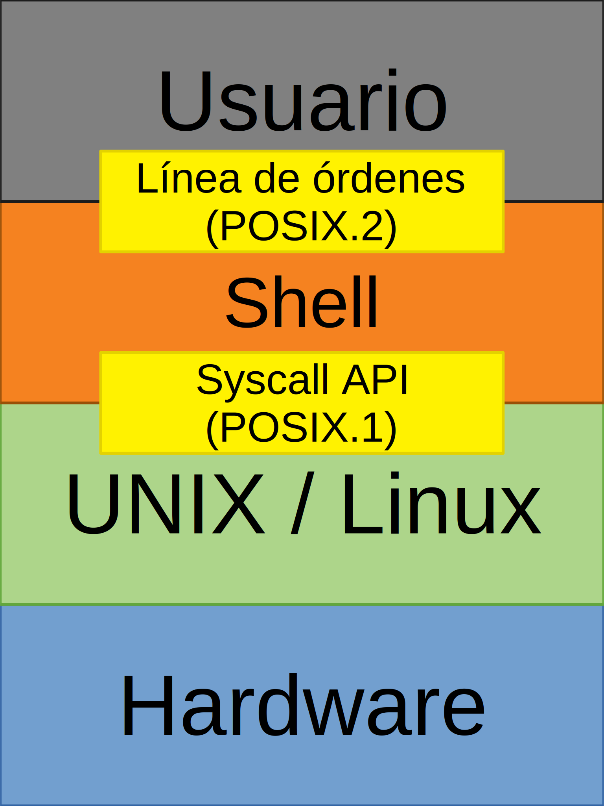
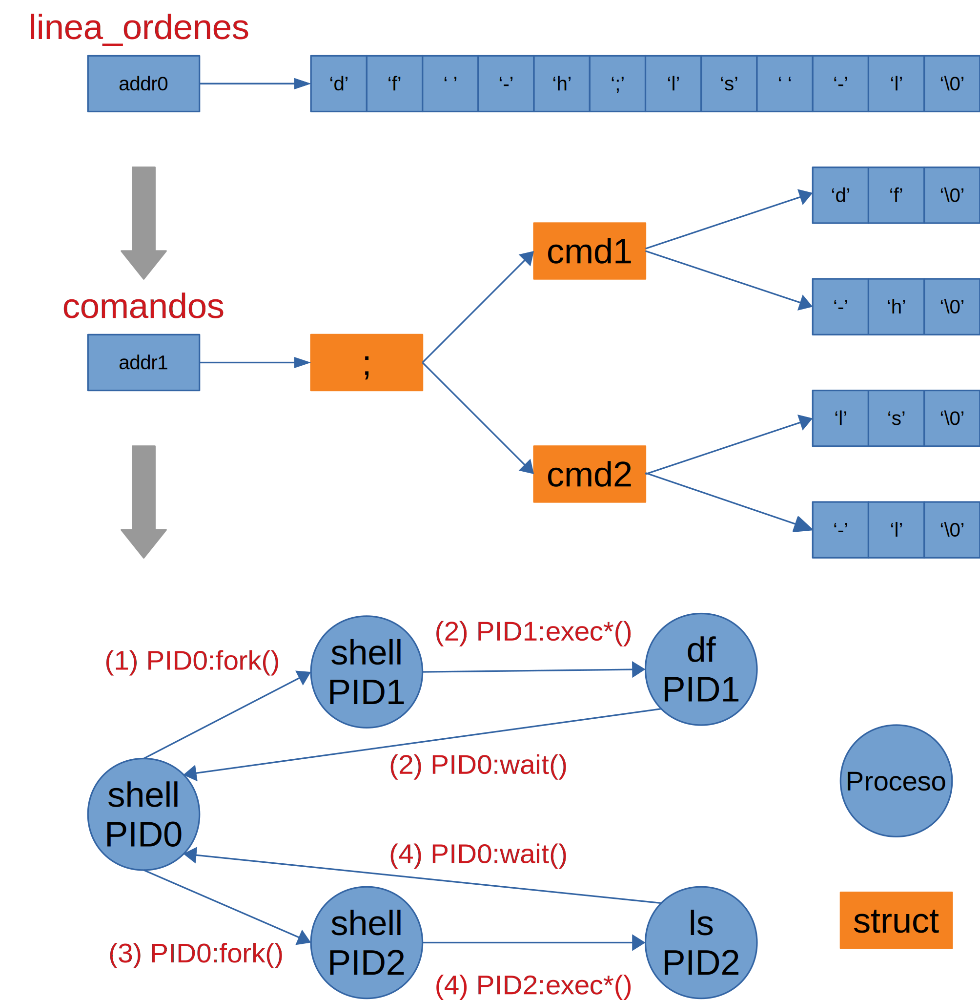
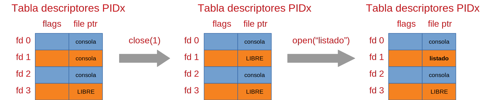

# Prácticas de Ampliación de Sistemas Operativos • Semana 2

- [Prácticas de Ampliación de Sistemas Operativos • Semana 2](#prácticas-de-ampliación-de-sistemas-operativos--semana-2)
  - [Intérprete de comandos, intérprete de órdenes o *shell*](#intérprete-de-comandos-intérprete-de-órdenes-o-shell)
  - [Procesamiento de líneas de órdenes en un *shell*](#procesamiento-de-líneas-de-órdenes-en-un-shell)
  - [Ejemplo de ejecución de una línea de órdenes en un *shell*: `ls -la > listado`](#ejemplo-de-ejecución-de-una-línea-de-órdenes-en-un-shell-ls--la--listado)
  - [Ejecución de aplicaciones externas: `openpdf fichero.pdf`](#ejecución-de-aplicaciones-externas-openpdf-ficheropdf)
  - [Referencias](#referencias)
    - [Shell](#shell)
    - [C](#c)
    - [Llamadas al sistema y funciones de biblioteca](#llamadas-al-sistema-y-funciones-de-biblioteca)

---

## Intérprete de comandos, intérprete de órdenes o *shell*

Un intérprete de comandos, intérprete de órdenes o *shell* es un programa que
provee una interfaz de usuario para acceder a los servicios del sistema
operativo. El *shell* procesa las líneas de órdenes tecleadas por el usuario y
las ejecuta usando la *System Call API* del Sistema Operativo.



Los intérpretes de órdenes más comunes son:

- *Bourne shell* (`sh`)
- *Bourne again shell* (`bash`)
- *C shell* (`csh`)
- *Korn shell* (`ksh`)
- *Z shell* (`zsh`)

El *shell* está estandarizado (POSIX.2 ó 1003.2-1992). Tanto `ksh` como `bash`
se ajustan a POSIX.2 pero también incluyen algunas extensiones no portables.

La *System Call API* también está estandarizada (POSIX.1-2008 ó 1003.1-2008).
Cualquier aplicación que se ajuste al estándar, incluyendo el *shell*, será
portable a cualquier otro entorno que ofrezca la misma interfaz estándar.

El *shell* por defecto depende de la variante de UNIX o distribución de Linux.
Para averiguar el *shell* que usamos:

```bash
$ echo $SHELL
/bin/bash
```

## Procesamiento de líneas de órdenes en un *shell*

Después de leer una línea de órdenes, el *shell* la analiza, construye una
estructura de datos que representa dicha línea de órdenes, incluyendo los
operadores como `;`, `|`, `&`, `(...)` o redirecciones, y traduce cada orden a
una secuencia de llamadas al sistema y funciones de biblioteca. El proceso de
*traducción* depende de los operadores utilizados para enlazar las órdenes.

El siguiente fragmento de pseudocódigo resume el funcionamiento de un *shell*:

```C
while (1)
{
    /* Paso 1: Lectura de la línea de órdenes tecleada por el usuario */
    linea_ordenes = leer();

    /* Paso 2: Análisis sintáctico de la línea de órdenes */
    comandos = analizar(linea_ordenes);

    /* Paso 3: Ejecución de la línea de órdenes */
    ejecutar(comandos);
}
```

Por ejemplo, supongamos que el usuario teclea la línea de órdenes `df -h;ls -l`.



Para ilustrar este modo de funcionamiento, fijémonos en qué pasa cuando
tecleamos `pstree -p -s $$` en `bash` (`$$` equivale al PID de `bash`) repetidas
veces:

```bash
$ pstree -p -s $$
systemd(1)──systemd(2598)──gnome-terminal-(9396)──bash(9458)──pstree(30637)

$ pstree -p -s $$
systemd(1)──systemd(2598)──gnome-terminal-(9396)──bash(9458)──pstree(30639)

$ pstree -p -s $$
systemd(1)──systemd(2598)──gnome-terminal-(9396)──bash(9458)──pstree(30641)
```

Como se puede ver, el PID de `pstree` cambia después cada ejecución, no así el
de `bash`.

- [ ] Modifica el ejemplo `hello.c` de la sesión anterior para que imprima tanto
      su PID como el de su proceso padre. El PID del proceso padre debe ser el
      del proceso `bash` desde el que se ejecuta `./hello`. Compruébalo con
      `echo $$`.

## Ejemplo de ejecución de una línea de órdenes en un *shell*: `ls -la > listado`

Para ilustrar la ejecución de líneas de órdenes (Paso 3), vamos a escribir un
programa que hace las veces de *shell* para ejecutar la línea de órdenes
`ls -la > listado`:

1. El proceso padre crea un proceso hijo con la llamada al sistema
   `fork()`.
2. El proceso hijo ejecuta `ls -la` con la llamada al sistema `execlp()`.
3. El proceso padre espera a que termine el proceso hijo con la llamada al
   sistema `wait()`.
4. El proceso hijo redirige su salida estándar al fichero `listado` antes de
   llamar a `execlp()`.

Para redirigir la salida estándar al fichero `listado`, el proceso hijo:

- `close(1)`: Cierra el descriptor de fichero de la salida estándar (1).
- `open("listado", ...)`: Abre el fichero `listado`, al que el kernel asigna el
  descriptor de fichero *no usado* más bajo (1).



- [ ] ¿Para qué sirven los flags `O_WRONLY | O_CREAT | O_TRUNC` y el modo
      `S_IRWXU` en el ejemplo anterior?
  - ¿Qué sucede si eliminamos `O_CREAT` y `listado` no existe?
  - ¿Qué pasa si `listado` existe y sus permisos son `--x--x--x`?
- [ ] Modifica el ejemplo anterior para que `listado` se cree con los permisos
      `rw-rw----`.
- [ ] Modifica el ejemplo anterior para sustituir `>` por `>>`, es decir, para
      ejecutar la línea de órdenes `ls -la >> listado`.
- [ ] Modifica el ejemplo anterior para usar `execv()` en lugar de `execlp()`.
- [ ] Modificar el ejemplo anterior para que use `waitpid()` en lugar de
      `wait()`.
  - Sustituye `ls -la` por `sleep 3600`, *mata* el proceso hijo con `kill -9
    PID` y verifica su *status* en el proceso padre.

## Ejecución de aplicaciones externas: `openpdf fichero.pdf`

La creación de procesos también resulta útil cuando una aplicación necesita
ejecutar otra aplicación diferente para llevar a cabo una acción determinada.
Por ejemplo, una aplicación que necesitase mostrar el contenido de un fichero
PDF podría usar un lector de ficheros PDF creando un proceso hijo que ejecutase
el binario de dicha aplicación.

- [ ] Escribe un programa `openpdf.c`, que se invoque como `./openpdf
      fichero.pdf`, para abrir `fichero.pdf` llamando a un lector de ficheros
      PDF externo, por ejemplo, `evince` en Ubuntu.
  - Se debe comprobar que `fichero.pdf` existe y se puede leer, antes de crear
    el proceso hijo para el lector de ficheros PDF externo, con `access()`.
  - El proceso padre no debe terminar su ejecución hasta que el lector de
    ficheros PDF externo se cierre.
    - ¿Qué pasa si en el proceso padre no se realiza ninguna llamada a
      `wait()/waitpid()`?
    - ¿Y si insertamos `sleep 3600` antes de `wait()/waitpid()` y cerramos el
      lector de ficheros PDF externo?

## Referencias

### Shell

- [Wikipedia - Shell](https://en.wikipedia.org/wiki/Shell_%28computing%29)

### C

- [Wikipedia - ANSI C](https://en.wikipedia.org/wiki/ANSI_C)
- [cppreference.com - C reference](https://en.cppreference.com/w/c)
- [GCC online documentation](https://gcc.gnu.org/onlinedocs/)

### Llamadas al sistema y funciones de biblioteca

- [The linux `man-pages` project](https://www.kernel.org/doc/man-pages/)
