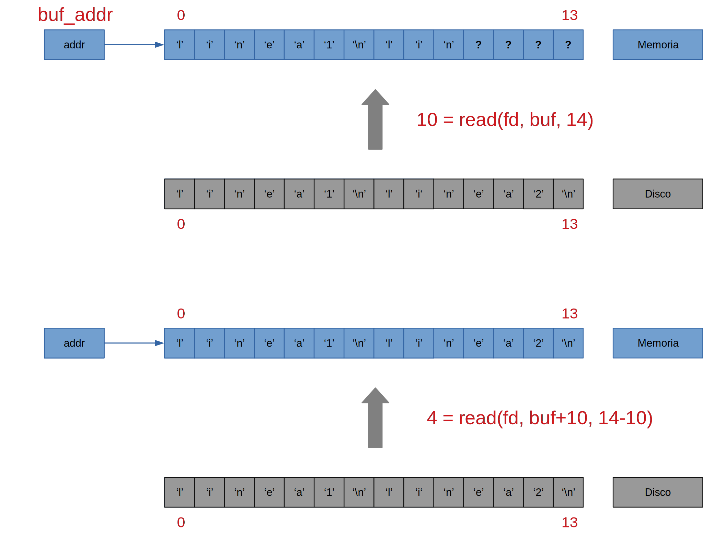
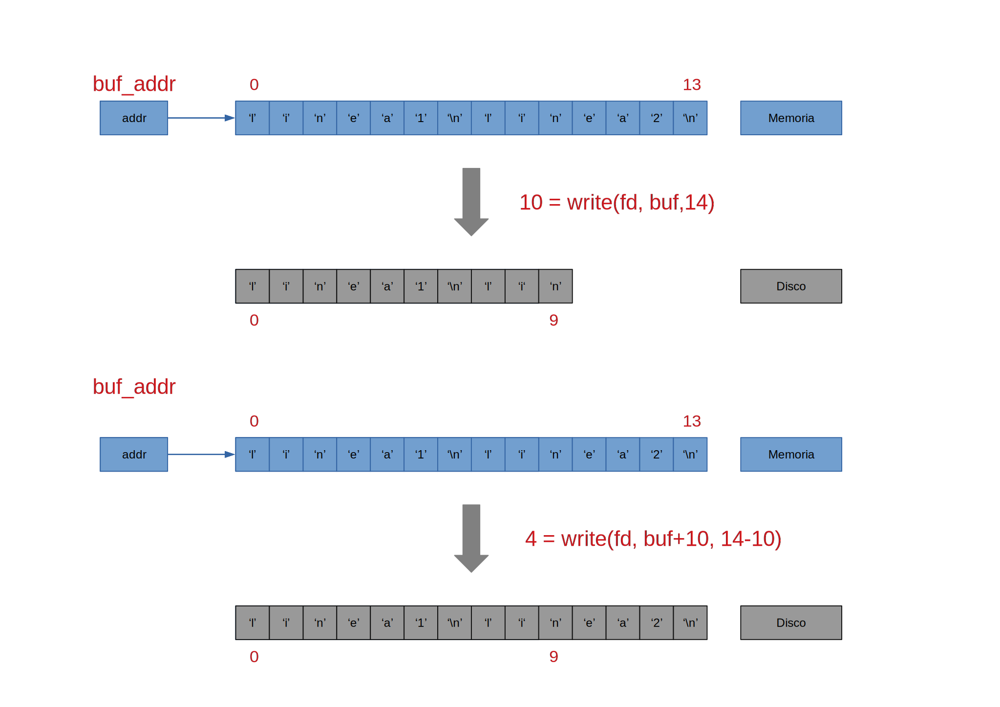
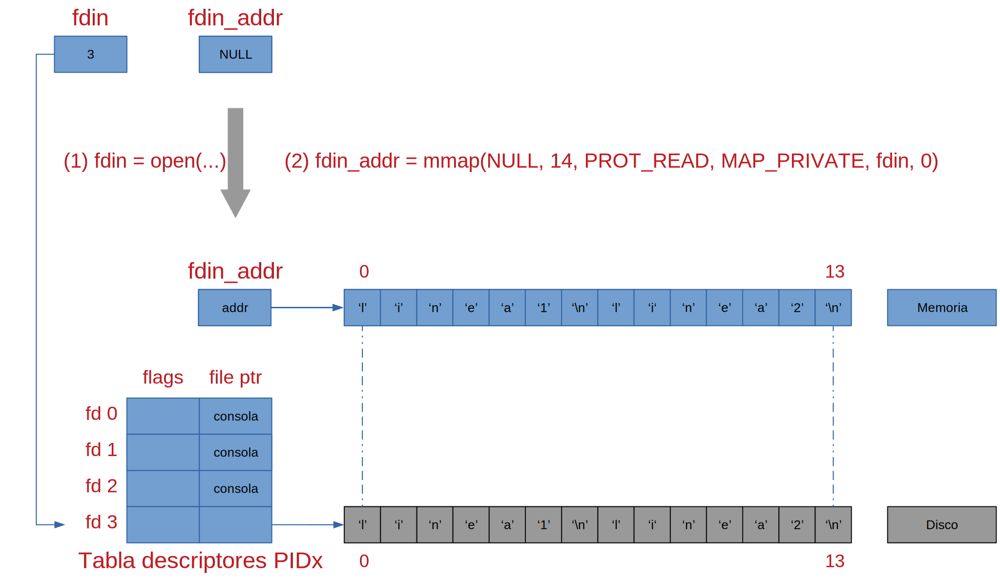

# Prácticas de Ampliación de Sistemas Operativos • Semana 3

- [Prácticas de Ampliación de Sistemas Operativos • Semana 3](#prácticas-de-ampliación-de-sistemas-operativos--semana-3)
  - [Procesamiento de ficheros con `open()`, `read()`, `write()` y `close()`](#procesamiento-de-ficheros-con-open-read-write-y-close)
  - [Ejemplo de procesamiento de ficheros: `cat_mem_din [-o FILEOUT] [FILEIN1 FILEIN2 ... FILEINn]`](#ejemplo-de-procesamiento-de-ficheros-cat_mem_din--o-fileout-filein1-filein2--fileinn)
    - [Ejemplos de ejecución de `cat_mem_din`](#ejemplos-de-ejecución-de-cat_mem_din)
  - [Procesamiento de ficheros con `mmap()` y `munmap()`](#procesamiento-de-ficheros-con-mmap-y-munmap)
  - [Ejemplo de procesamiento de ficheros: `cat_mem_vir [-o FILEOUT] FILEIN1 [FILEIN2 ... FILEINn]`](#ejemplo-de-procesamiento-de-ficheros-cat_mem_vir--o-fileout-filein1-filein2--fileinn)
    - [Ejemplos de ejecución de `cat_mem_vir`](#ejemplos-de-ejecución-de-cat_mem_vir)
  - [Referencias](#referencias)
    - [C](#c)
    - [Llamadas al sistema y funciones de biblioteca](#llamadas-al-sistema-y-funciones-de-biblioteca)

---

## Procesamiento de ficheros con `open()`, `read()`, `write()` y `close()`

En el *Modelo de E/S Universal*, cada fichero abierto o tubería (*pipe*) creada,
se representa mediante un descriptor de fichero (entero positivo).

Cuando el *shell* crea un proceso, éste tiene tres descriptores de fichero
abiertos: `STDIN_FILENO (0)`, `STDOUT_FILENO (1)` y `STDERR_FILENO (2)`.

Podemos averiguar los descriptores de fichero que usa un proceso accediendo a
`/proc`. Por ejemplo:

```bash
$ ls /proc/$$/fdinfo
0  1  2  255
```

Las cuatro llamadas al sistema básicas que se utilizan para operar sobre
descriptores de fichero son:

- `fd = open(fichero,...)`: Abre un fichero a partir de su nombre `fichero` y
  devuelve un descriptor de fichero `fd`.
- `nr = read(fd, buf, size)`: Intenta leer hasta `size` bytes del fichero al que
  se refiere `fd` y los escribe en `buf`. Devuelve el número real de bytes
  leídos o `nr`.
- `nw = write(fd, buf, size)`: Intenta escribir hasta `size` bytes de `buf` en
  el fichero al que se refiere `fd`. Devuelve el número real de bytes escritos o
  `nw`.
- `close(fd)`: Cierra un fichero a partir de su descriptor de fichero `fd`.

Nótese que `buf` debe ser una zona de memoria capaz de almacenar hasta
`size` bytes. Sin embargo, tanto `read()` como `write()` podrían
devolver menos bytes de los indicados en la llamada, lo cual no es un
error, por lo que siempre se cumplirá que `nr <= size` o `nw <= size`.

Cuando `nr < size`, hablamos de *lecturas parciales*:



Si `nw < size`, se producen *escrituras parciales*:



La biblioteca estándar de C utiliza *streams* en lugar de descriptores de
fichero. Los *streams* `stdin`, `stdout` y `stderr` equivalen a `STDIN_FILENO`,
`STDOUT_FILENO` y `STDERR_FILENO`. La función de biblioteca `printf()` es
equivalente a `fprintf(stdout,...)` que, a su vez, se basa en
`write(STDOUT_FILENO,...)`.

Con el ejemplo `hello.c` y la utilidad
[strace](https://www.man7.org/linux/man-pages/man1/strace.1.html), se puede
comprobar que cada llamada a `printf()` o `fprintf()` se traduce en una llamada
al sistema `write()`:

```bash
$ strace -e trace=write ./hello
write(1, "Hello, ASO!\n", 12) = 12
Hello, ASO!
write(1, "Hello, ASO!\n", 12) = 12
Hello, ASO!
write(2, "Hello, ASO!\n", 12) = 12
Hello, ASO!
write(1, "Hello, ASO!\n", 12) = 12
Hello, ASO!
```

## Ejemplo de procesamiento de ficheros: `cat_mem_din [-o FILEOUT] [FILEIN1 FILEIN2 ... FILEINn]`

Para ilustrar el procesamiento de ficheros con las llamadas al sistema `open()`,
`read()`, `write()` y `close()`, vamos a escribir un programa, similar a la
utilidad `cat`, que dado un conjunto de ficheros de entrada, `[FILEIN1 FILEIN2
... FILEINn]`, los va leyendo fragmento a fragmento, al tiempo que escribe cada
uno de esos fragmentos en un fichero de salida, `[-o FILEOUT]`.

- [ ] ¿Por qué no se abre cada fichero de entrada en la misma función `catfd()`?
- [ ] ¿Por qué se llama a `read()` hasta que devuelva `0`, escribiendo en el
  fichero de salida tras cada lectura?
  - *Pista*: `base64 /dev/urandom | head -c 1073741824 | ./cat_mem_din | grep
    ASO`.
- [ ] Modifica el ejemplo anterior para incluir el tratamiento de *escrituras
  parciales*.
- [ ] Modifica el ejemplo anterior para redirigir la salida estándar de error a
  un fichero llamado `error.log` con `dup2()`.

### Ejemplos de ejecución de `cat_mem_din`

```bash
$ ./cat_mem_din
ASO
ASO
(Ctrl+D)

$ echo -e "linea1\nlinea2" > filein1 ; ./cat_mem_din filein1
linea1
linea2

$ cp filein1 filein2 ; ./cat_mem_din filein1 filein2
linea1
linea2
linea1
linea2

$ ./cat_mem_din -o fileout filein1 filein2 ; cat fileout
linea1
linea2
linea1
linea2

$ echo -e "linea1\nlinea2\n...\nlineaN" | ./cat_mem_din | grep "\.\.\."
...
```

## Procesamiento de ficheros con `mmap()` y `munmap()`

La llamada al sistema `mmap()` permite mapear un fichero en el espacio de
direcciones de un proceso. Eso significa poder acceder a un fichero mediante un
puntero como si todo su contenido se encontrase a partir de la dirección de
memoria almacenada en dicho puntero. En la clase de teoría se han visto dos
tipos de ficheros mapeados en memoria: privados y compartidos. Durante esta
sesión de prácticas vamos a ilustrar su uso implementando el ejemplo anterior
con un fichero mapeado en memoria privado para cada fichero de entrada. Desde un
punto de vista práctico, eso equivale a poder leer el fichero sin tener que
llamar a `read()`.



## Ejemplo de procesamiento de ficheros: `cat_mem_vir [-o FILEOUT] FILEIN1 [FILEIN2 ... FILEINn]`

- [ ] ¿Qué sucede si intentamos escribir en el fichero de entrada que se mapea
  en memoria?
- [ ] Modifica el ejemplo anterior para que se calcule un *checksum* de 32-bits
  de cada fichero de entrada, sumando todos su contenido como si fueran enteros,
  y se imprima en el fichero de salida como un número hexadecimal de ocho
  dígitos seguido de `'\n'`.

### Ejemplos de ejecución de `cat_mem_vir`

```bash
Prácticas ASO->src$ ./cat_mem_vir
Uso: ./cat_mem_vir [-o FILEOUT] FILEIN1 [FILEIN2 ... FILEINn]

$ echo -e "linea1\nlinea2" > filein1 ; ./cat_mem_vir filein1
linea1
linea2

$ cp filein1 filein2 ; ./cat_mem_vir filein1 filein2
linea1
linea2
linea1
linea2

$ ./cat_mem_vir -o fileout filein1 filein2 ; cat fileout
linea1
linea2
linea1
linea2
```

## Referencias

### C

- [Wikipedia - ANSI C](https://en.wikipedia.org/wiki/ANSI_C)
- [cppreference.com - C reference](https://en.cppreference.com/w/c)
- [GCC online documentation](https://gcc.gnu.org/onlinedocs/)

### Llamadas al sistema y funciones de biblioteca

- [The linux `man-pages` project](https://www.kernel.org/doc/man-pages/)
