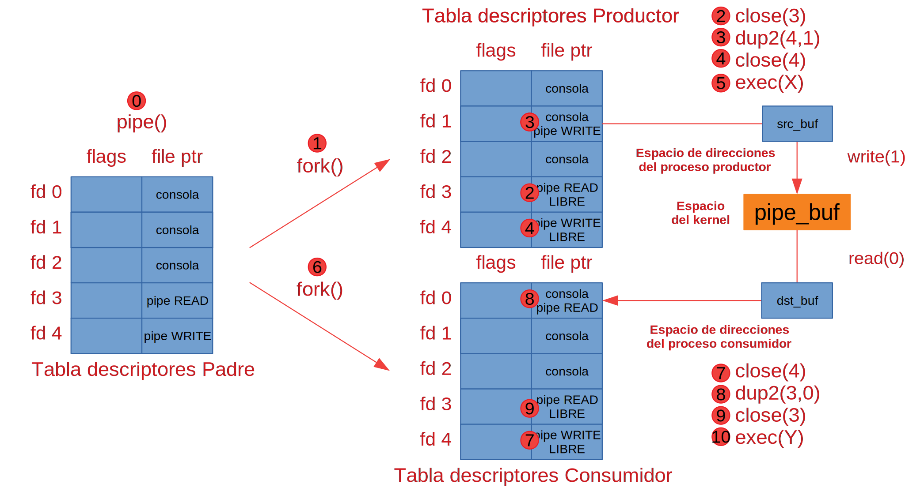

# Prácticas de Ampliación de Sistemas Operativos • Semana 4

- [Prácticas de Ampliación de Sistemas Operativos • Semana 4](#prácticas-de-ampliación-de-sistemas-operativos--semana-4)
  - [Uso de Tuberías](#uso-de-tuberías)
  - [Ejemplo de uso de tuberías: `shell_ytdl_pipe_ffmpeg -u YTURL -f FICHERO.mp4`](#ejemplo-de-uso-de-tuberías-shell_ytdl_pipe_ffmpeg--u-yturl--f-ficheromp4)
    - [Ejemplos de ejecución de `shell_ytdl_pipe_ffmpeg`](#ejemplos-de-ejecución-de-shell_ytdl_pipe_ffmpeg)
    - [Descarga e instalación de `youtube-dl`](#descarga-e-instalación-de-youtube-dl)
  - [Uso de Señales](#uso-de-señales)
  - [Ejemplo de manejo de señales: `openpdf.SIGCHLD.c fichero.pdf`](#ejemplo-de-manejo-de-señales-openpdfsigchldc-ficheropdf)
    - [Ejemplos de ejecución de `openpdf.SIGCHLD`](#ejemplos-de-ejecución-de-openpdfsigchld)
  - [Referencias](#referencias)
    - [Señales](#señales)
    - [C](#c)
    - [Llamadas al sistema y funciones de biblioteca](#llamadas-al-sistema-y-funciones-de-biblioteca)

---

## Uso de Tuberías

Una tubería o *pipe* es un flujo de bytes unidireccional entre dos procesos, un
productor y un consumidor, en el que la entrega de los datos **siempre** se
produce en orden.


La llamada al sistema `pipe()` crea una tubería con dos descriptores de fichero
abiertos, uno para lectura (`pipefds[0]`) y otro para escritura (`pipefds[1]`):

```C
#include <unistd.h>
int pipefds[2];
if (pipe(pipefds) == -1)
{
  perror ("pipe()");
  exit(EXIT_FAILURE);
}
```

Internamente, cada tubería usa un *buffer* en el espacio de direcciones del
kernel de capacidad limitada. Cuando el proceso productor escribe en la
tubería con la llamada al sistema `write()`, el contenido de su buffer de
escritura se copia en el buffer del kernel. Asimismo, cuando el proceso
productor lee de la tubería con la llamada al sistema `read()`, el contenido
del buffer del kernel se copia en su buffer de lectura.


Una lectura con `read()` de una tubería *vacía* se bloquea. Si se cierra el otro
extremo de la tubería, la llamada a `read()` devuelve un 0. Una escritura con
`write()` en una tubería *llena* se bloquea también. Si se cierra el otro
extremo de la tubería, la llamada a `write()` devuelve `-1` y la variable global
`errno` se actualizará a `EPIPE`.

El tamaño del buffer de las tuberías se puede comprobar con la siguiente línea
de órdenes:

```bash
$ cat /proc/sys/fs/pipe-max-size
1048576
```

Los descriptores de fichero abiertos de un proceso se heredan cuando se realiza
una llamada al sistema `fork()`. Así, una tubería puede utilizarse para
comunicación/sincronización entre procesos que fueron creados por un *ancestro*
común. Por ejemplo, si un proceso crea una tubería llamando a `pipe()` y luego
dos procesos hijo con `fork()`, ambos podrán comunicarse a través de la tubería.

Las tuberías son utilizadas constantemente en `bash` para conectar procesos en
secuencia, de manera que cada uno toma la salida del anterior como entrada para
generar su propia salida. En estos casos las tuberías se utilizan junto con la
redirección para *engañar* a los programas conectados por la tubería
(normalmente binarios invocados con `exec*()`) para que tomen su entrada de la
tubería, en lugar de la entrada estándar, o saquen su salida por la tubería, en
lugar de la salida estándar.

En el ejemplo, el proceso padre crea la tubería, el proceso hijo de la
izquierda redirecciona la salida estándar al extremo de escritura de la tubería,
y el proceso hijo de la derecha redirecciona la entrada estándar al extremo de
lectura de la tubería:



Por supuesto, si queremos conectar dos procesos que no ejecutan ninguna utilidad
externa con `exec*()` mediante una tubería, NO necesitamos redireccionar sus
entradas y salidas estándar, ya que tenemos acceso al código y podemos hacer que
ambos usen directamente la tubería. En este caso, los pasos 3-5 y 8-10 de la
figura anterior no serían necesarios.

## Ejemplo de uso de tuberías: `shell_ytdl_pipe_ffmpeg -u YTURL -f FICHERO.mp4`

Para mostrar el uso de las tuberías, escribiremos un programa que hace las veces
de *shell* para ejecutar la línea de órdenes

```bash
youtube-dl YTURL -q -o - | ffmpeg -i - FICHERO.mp4
```

Dada una URL de YouTube `YTURL`, el programa almacena en disco el vídeo
correspondiente en el fichero `FICHERO.mp4`. La utilidad
[`youtube-dl`](https://github.com/ytdl-org/youtube-dl) realiza la descarga desde
YouTube, mientras que [`ffmpeg`](https://github.com/FFmpeg/FFmpeg) permite
manipular el *stream* de vídeo antes de almacenarlo en el disco.

- [ ] ¿Qué pasa cuando `FICHERO` ya existe? ¿Por qué?
- [ ] ¿Qué sucede si el hijo de la derecha no cierra el extremo de escritura de
      la tubería? ¿Por qué?
- [ ] Redirige la salida estándar de error del proceso hijo derecho a un fichero
      llamado `ffmpeg.log`.
- [ ] Modifica el ejemplo anterior para que el proceso padre espere a los
      procesos hijos en orden de creación.

**Nota**: En muchas utilidades el carácter `-` se utiliza para indicar la
entrada estándar o la salida estándar.

### Ejemplos de ejecución de `shell_ytdl_pipe_ffmpeg`

```bash
$ ./shell_ytdl_pipe_ffmpeg
Uso: ./shell_ytdl_pipe_ffmpeg [-u YTURL] [-f FICHERO]

$ ./shell_ytdl_pipe_ffmpeg -u https://www.youtube.com/watch?v=NevkMN3WVWg -f video.mp4
. . .
$ ls video.mp4
video.mp4
```

### Descarga e instalación de `youtube-dl`

Si `youtube-dl` no está instalado o si la versión es antigua, se puede descargar
con la siguiente línea de órdenes:

```bash
wget https://yt-dl.org/downloads/latest/youtube-dl -O youtube-dl
```

:pushpin: Para poder usarlo en `shell_ytdl_pipe_ffmpeg`, tenemos que darle
permiso de ejecución:

```bash
chmod +x youtube-dl
```

También debemos modificar la primera llamada a `execlp()` para añadir `./` al
binario.

## Uso de Señales

Una señal es una notificación que recibe un proceso cuando se producen ciertos
eventos:

- Excepción hardware: Dirección de memoria inválida (por ejemplo, `SIGSEGV`).
- Evento software: Un proceso hijo ha terminado (por ejemplo, `SIGCHLD`).
- Notificación de E/S: Por ejemplo, interrupción con `Ctrl+C` (`SIGINT`).

Desde que se produce el evento que origina una señal hasta que ésta se entrega,
la señal está *pendiente*. Las señales se entregan cuando se produce una
transición de modo usuario a modo kernel, es decir, cuando se completa una
llamada al sistema o cuando se reanuda la ejecución del proceso. No obstante, un
proceso puede bloquear la entrega de una señal mediante una máscara de señales
*bloqueadas* con la llamada al sistema `sigprocmask()`, o ignorarla con la
llamada al sistema `sigaction()`.

Cuando un proceso recibe una señal, ejecuta la acción por defecto: ignorarla,
terminar, detenerse o continuar. La acción por defecto se puede cambiar para
hacer que una señal sea ignorada o para ejecutar un *manejador de señales*. Un
manejador de señales no es más que una función definida por el usuario que se
ejecuta cada vez que se recibe una señal concreta. Para instalar un manejador de
señales, se usa la llamada al sistema `sigaction()`.

Por ejemplo, cuando tecleamos `kill PID`, estamos enviando la señal `TERM` al
proceso identificado por `PID`. La acción por defecto para dicha señal es terminar
el proceso. Para ver la lista completa de señales, basta con teclear `kill -L`.


## Ejemplo de manejo de señales: `openpdf.SIGCHLD.c fichero.pdf`

Para ilustrar el manejo de señales, hemos modificado el ejemplo `openpdf.c`
explicado en una sesión anterior. El ejemplo modificado, `openpdf.SIGCHLD.c`,
bloquea la señal `SIGINT`, lo que impide que se interrumpa su ejecución con
`Ctrl+C`. Además, instala un manejador de señales para la señal `SIGCHLD`. Cada
vez que el proceso que ejecuta el lector de ficheros PDF termina, envía una
señal `SIGCHLD` a su proceso padre. En nuestro caso, el proceso padre utiliza la
notificación para reiniciar el lector de ficheros PDF.

- [ ] ¿Qué sucede si intentamos interrumpir la ejecución del ejemplo anterior
  con `Ctrl+C`? ¿Por qué?
- [ ] Modifica el ejemplo anterior para que termine su ejecución cuando el
      lector de ficheros PDF finalice con normalidad.

### Ejemplos de ejecución de `openpdf.SIGCHLD`

```bash
$ ./openpdf.SIGCHLD
Uso: ./openpdf.SIGCHLD FILE.pdf

$ ./openpdf.SIGCHLD fichero.pdf
main(): Creando lector de PDF...
main(): Lector de PDF creado...
(Ventana del lector de ficheros PDF: `Cerrar`)
manejador(): Reiniciando lector de PDF...
main(): Lector de PDF creado...
(Otra consola: `killall evince`)
manejador(): Reiniciando lector de PDF...
main(): Lector de PDF creado...
...
```

## Referencias

### Señales

- [Wikipedia - Signals](https://en.wikipedia.org/wiki/Signal_(IPC))
- [signal(7) — Linux manual page](https://man7.org/linux/man-pages/man7/signal.7.html)
- [signal-safety(7) — Linux manual page](https://man7.org/linux/man-pages/man7/signal-safety.7.html)

### C

- [Wikipedia - ANSI C](https://en.wikipedia.org/wiki/ANSI_C)
- [cppreference.com - C reference](https://en.cppreference.com/w/c)
- [GCC online documentation](https://gcc.gnu.org/onlinedocs/)

### Llamadas al sistema y funciones de biblioteca

- [The linux `man-pages` project](https://www.kernel.org/doc/man-pages/)
